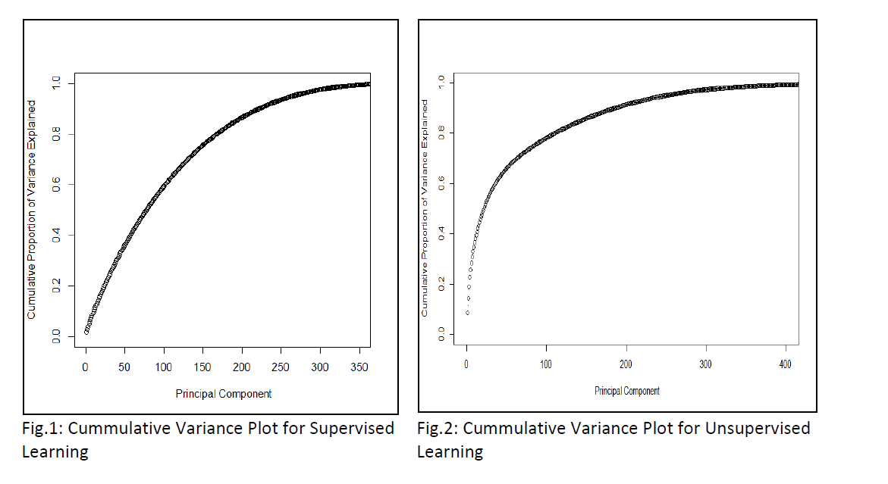
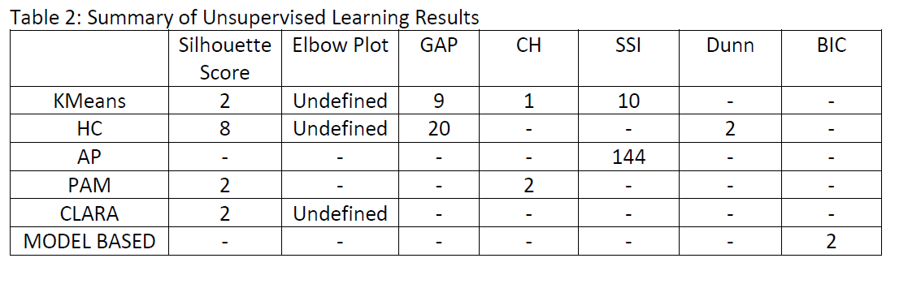
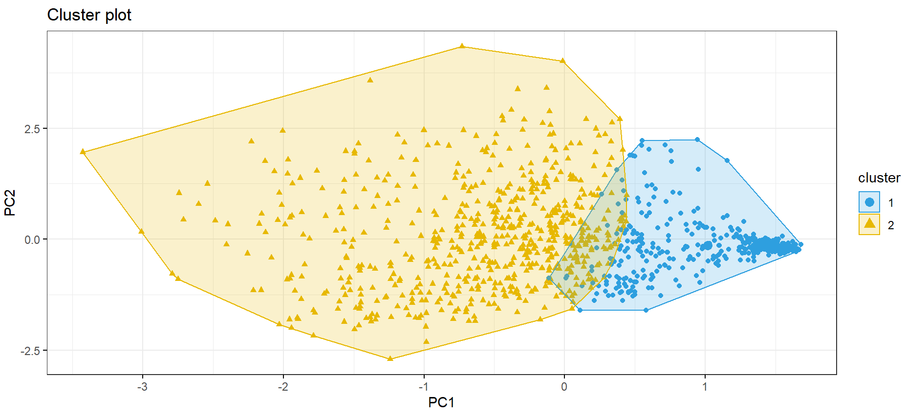

# Clustering: Final Project for Graduate Level Data Mining Course 

The dataset contains 1000 observations and 784 variables. We applied PCA for variable reduction. The elbow for the PCA cumulative variance plot occurs at about 400 PC (see figure 2) – about 50% reduction in variables. Thus, all our analyses are based on the first 400 PCs.

We used different clustering algorithm including KMeans, Hierarchical Clustering (HC), Affinity
Propagation (AP), Partition Around Medoids (PAM), Model-based clustering based on parameterized finite Gaussian mixture models and Clustering Large Applications (CLARA) .

Optimal number of clusters were determined using Silhouette score, elbow plot, gap statistics method, Calinski-Harabasz criterion, simple structure index, Dunn index, Bayesian Information Criterion (BIC), and combination of indices contained in “NbClust” library. Table 2 contains the summary of results from the clustering algorithm.

The most re-occurring optimal cluster is 2, as contained in table 2. Furthermore, we used the
30 indices contained in “NbClust” library with 5 methods of clustering including KMeans and 4 variants HC. According to the majority rule, four of the methods predicted 2 as optimal number of clusters and one variant of HC predicted 6 clusters. Conclusively, we chose 2 as the optimal number of clusters and the data can be clustered by any of the methods stated above, except AP.

# Result:

